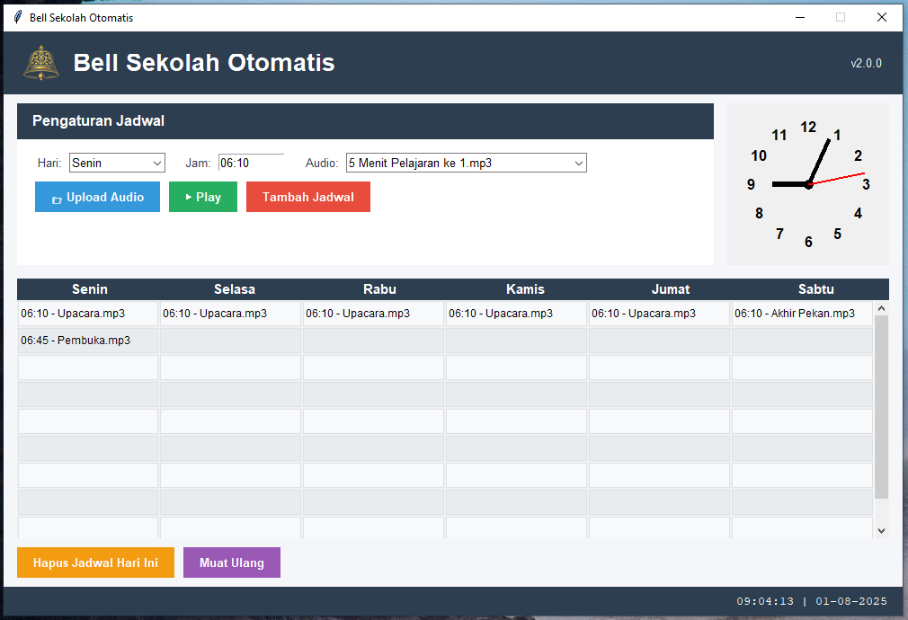

# 🔔 Bell Sekolah Otomatis

**Versi**: `v3.0.0`  
**Powered by**: Nurindra  
**Repositori**: [GitHub](https://github.com/rafacraft1/bell-sekolah-v3)

Aplikasi desktop berbasis Python untuk **penjadwalan bel otomatis** di sekolah. Dirancang dengan antarmuka grafis modern dan fitur lengkap untuk mempermudah pengaturan bel masuk, istirahat, dan pulang.
Aplikasi ini masih dalam pengembangan jika terjadi error dalam penggunaan silahkan ajukan Issue di github

---

## 🚀 Fitur Unggulan

- ✅ Antarmuka GUI interaktif (Tkinter)
- ✅ Penjadwalan audio berdasarkan hari dan jam
- ✅ Support format audio `.mp3`, `.wav`, `.ogg`
- ✅ Tray icon dengan shortcut praktis
- ✅ Notifikasi saat bel diputar
- ✅ Database SQLite internal
- ✅ Responsive layout dan auto-scaling UI
- ✅ Auto start (opsional) saat boot
- ✅ Logging otomatis setiap aktivitas/error
- ✅ Reset cepat ke pengaturan default

---

## 🖥️ Tampilan Antarmuka

 <!-- Tambahkan file gambar jika tersedia -->

---

## 📦 Struktur Proyek

```bash
bell-sekolah-v3/
├── audio/                 # Folder audio custom pengguna
│   └── default/           # Audio default dari GitHub
├── assets/                # Aset gambar/icon
├── gui/                   # Komponen antarmuka pengguna
│   ├── main_window.py     # Jendela utama
│   ├── tray_icon.py       # System tray controller
│   ├── components.py      # Komponen GUI modular
├── logs/                  # File log harian
├── bell.db                # Database SQLite
├── audio_player.py        # Pemutar audio menggunakan Pygame
├── config.py              # Metadata versi
├── constants.py           # Konstanta global
├── data_manager.py        # Manajemen data & database
├── scheduler.py           # Penjadwal otomatis bel
├── logger.py              # Sistem logging
├── utils.py               # Utilitas tambahan
└── main.py                # Entry point aplikasi
```

# ⚙️ Cara Menjalankan

### 🔧 Persyaratan

- Python `>= 3.8`
- Paket pip yang dibutuhkan:
  - `pygame`
  - `pystray`
  - `Pillow`
  - `win10toast` *(opsional, hanya untuk Windows)*

---

### 📥 Instalasi

```bash
git clone https://github.com/rafacraft1/bell-sekolah-v3.git
cd bell-sekolah-v3
pip install -r requirements.txt
python main.py
```

## License

MIT © Nurindra Project<br/>
Original Creator - [Nurindra aka Rafacraft1](https://github.com/rafacraft1)
